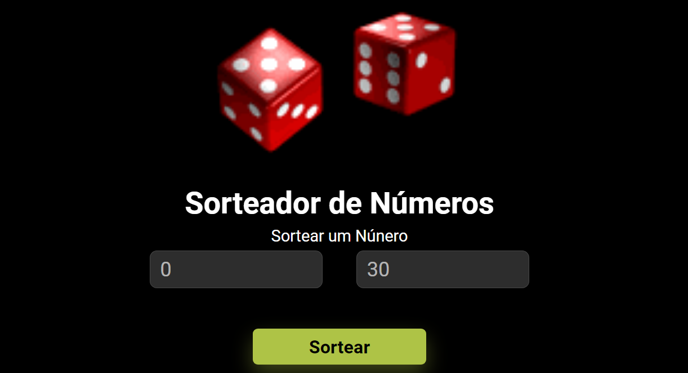

# Sorteador Aleatório

Este é um projeto simples que consiste em um sorteio aleatório de números. O usuário pode definir o intervalo dos números a serem sorteados e obter o resultado.

## Funcionalidades

- Permite ao usuário definir um intervalo de números para realizar o sorteio.
- Gera um número aleatório dentro do intervalo fornecido.
- Exibe o número sorteado em um alerta.

## Como utilizar

1. Insira o número mínimo desejado no primeiro campo de entrada.
2. Insira o número máximo desejado no segundo campo de entrada.
3. Clique no botão "Sortear".
4. O número sorteado será exibido em um alerta.

## Tecnologias utilizadas

- HTML
- CSS
- JavaScript

## Contribuição

Contribuições são bem-vindas! Sinta-se à vontade para abrir uma issue ou enviar um pull request com melhorias, correções de bugs ou novas funcionalidades.

## Licença

Este projeto está licenciado sob a [MIT License](LICENSE).
